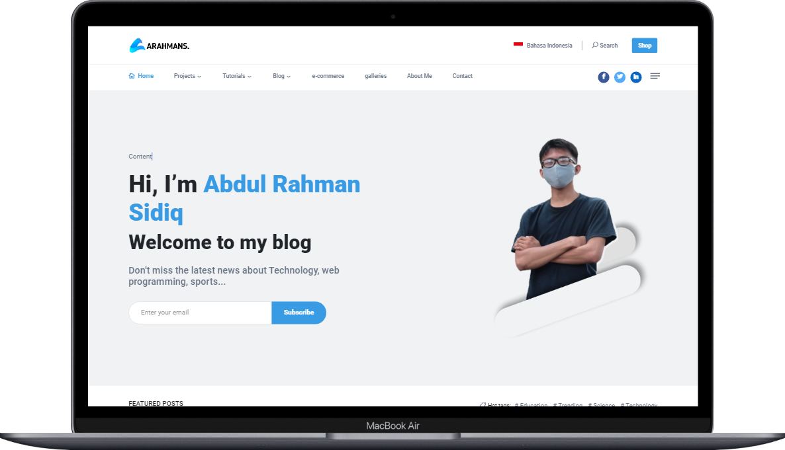

 
    

        
    

    
ABDUL RAHMAN SIDIQ

    

        Hi 👋, I'm Arahmans, founder of klibli.com, I love coding web programming so much that it's my hobby. besides that I am a youtuber and web developer.
    

     
    

        
        
    

    

  Programming Language

        

        

  Framework

    
    
    
    
    
    
    

<a href="https://rifqirosyidi.github.io">
    

        
    

</a>

    
### 
📱 Contacts Me

    
    
    
    

